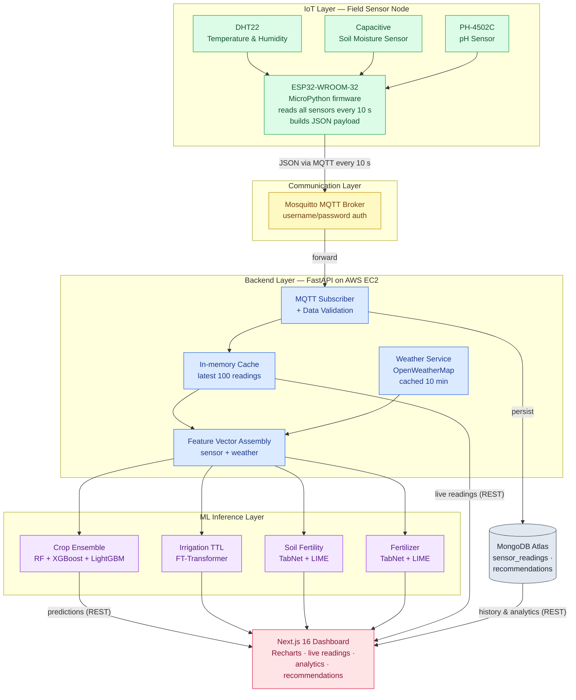

# Figure 1: Overall System Block Diagram

**Report location:** Section 4.1 — System Overview
**Tool:** Mermaid (paste into https://mermaid.live → Actions → Export PNG/SVG)
**Caption to use in report:** *Figure 1: Overall System Block Diagram*

This diagram shows the five-layer pipeline: IoT → Communication → Backend → ML Inference → Frontend, with MongoDB Atlas and OpenWeatherMap as supporting services.

---

## Mermaid Code

---

## Export tips
- Paste the code into https://mermaid.live, wait for the live preview, then use **Actions → PNG** (transparent or white background) or **SVG** for vector quality.
- If the diagram looks too tall, change the first line to `flowchart LR` for a left-to-right layout.
- Colors are set via `classDef`; remove the styling block if you prefer a plain black-and-white figure for print.
