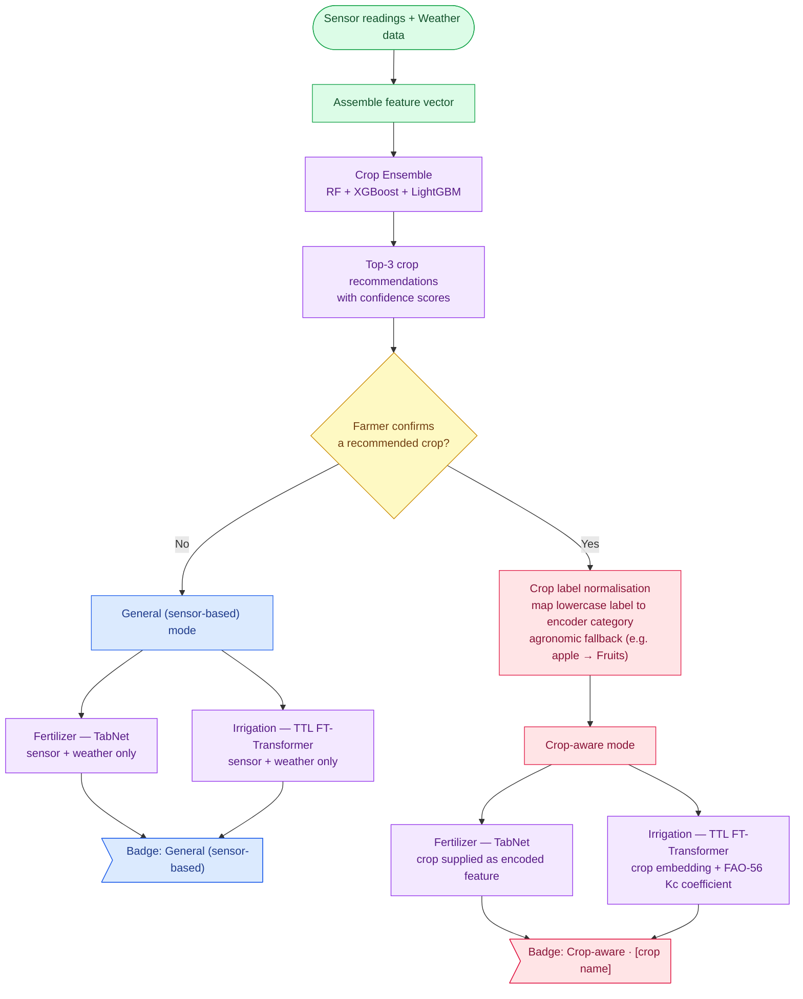

# Figure 2: Crop-Aware Decision Flow Diagram

**Report location:** Section 4.5 — Crop-Aware Decision Flow
**Tool:** Mermaid (paste into https://mermaid.live → Actions → Export PNG/SVG)
**Caption to use in report:** *Figure 2: Crop-Aware Decision Flow Diagram*

This diagram shows the two operating modes (General sensor-based vs. Crop-aware) and how a confirmed crop personalises the fertilizer and irrigation models.

---

## Mermaid Code

---

## Export tips
- The `>"..."]` shape renders the two badges as flag/asymmetric nodes to make them stand out. If your Mermaid version complains, replace `GBADGE>"..."]` and `CBADGE>"..."]` with rectangular `GBADGE["..."]` and `CBADGE["..."]`.
- Keep `flowchart TD` (top-down) — it reads naturally as a decision flow. Switch to `LR` only if the page is wider than tall.
- Remove the `classDef`/`class` block for a plain black-and-white print version.
