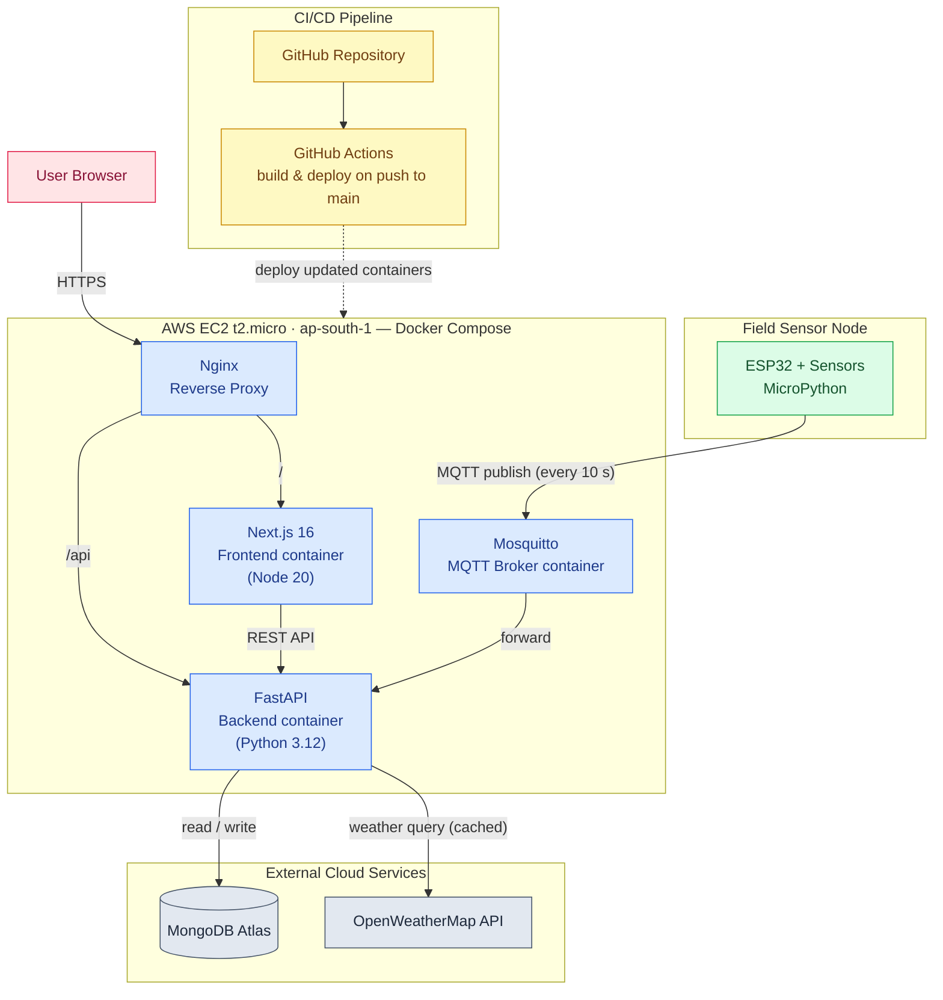

# Figure 3: Deployment Architecture Diagram

**Report location:** Section 4.7 — Deployment Architecture
**Tool:** Mermaid (paste into https://mermaid.live → Actions → Export PNG/SVG)
**Caption to use in report:** *Figure 3: Deployment Architecture Diagram*

This diagram shows the four Docker Compose services on a single AWS EC2 t2.micro instance, the external cloud services (MongoDB Atlas, OpenWeatherMap), the GitHub Actions CI/CD pipeline, and the data flow from the ESP32 sensor node to the user's browser.

---

## Mermaid Code

---

## Export tips
- `flowchart TB` (top-bottom) keeps the EC2 box and external services neatly stacked. Use `LR` if you want a wider, shorter figure.
- The dotted arrow (`-.->`) marks the CI/CD deploy path so it visually differs from the runtime data flow.
- Remove the `classDef`/`class` block for a plain black-and-white print version.
